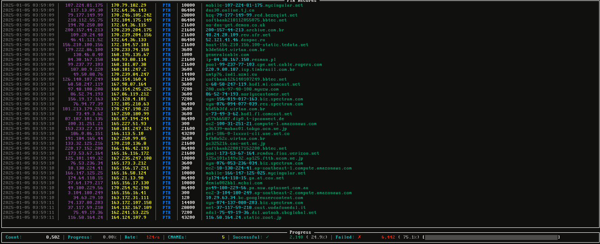

# PTR Stream



PTR Stream is a high-performance reverse DNS *(PTR record)* lookup tool written in Go. It efficiently processes the entire IPv4 address space, performing concurrent DNS lookups with support for custom DNS servers, output logging, and real-time progress visualization.

## Installation

```bash
go install github.com/acidvegas/ptrstream@latest
```

Or, build from source:

```bash
git clone https://github.com/acidvegas/ptrstream
cd ptrstream
go build
```

## Usage

```bash
ptrstream [options]
```

###### Command Line Arguments
| Flag    | Description                          | Default | Example                |
|---------|--------------------------------------|---------|------------------------|
| `-c`    | Concurrency level                    | `100`   | `-c 200`               |
| `-t`    | Timeout for DNS queries              | `2s`    | `-t 5s`                |
| `-r`    | Number of retries for failed lookups | `2`     | `-r 3`                 |
| `-dns`  | File containing DNS servers          |         | `-dns nameservers.txt` |
| `-debug`| Show unsuccessful lookups            | `False` | `-debug`               |
| `-o`    | Path to NDJSON output file           |         | `-o results.json`      |
| `-s`    | Seed for IP generation               | Random  | `-s 12345`             |
| `-shard`| Shard specification                  |         | `-shard 1/4`           | 

---

###### Mirrors: [acid.vegas](https://git.acid.vegas/ptrstream) • [SuperNETs](https://git.supernets.org/acidvegas/ptrstream) • [GitHub](https://github.com/acidvegas/ptrstream) • [GitLab](https://gitlab.com/acidvegas/ptrstream) • [Codeberg](https://codeberg.org/acidvegas/ptrstream)
