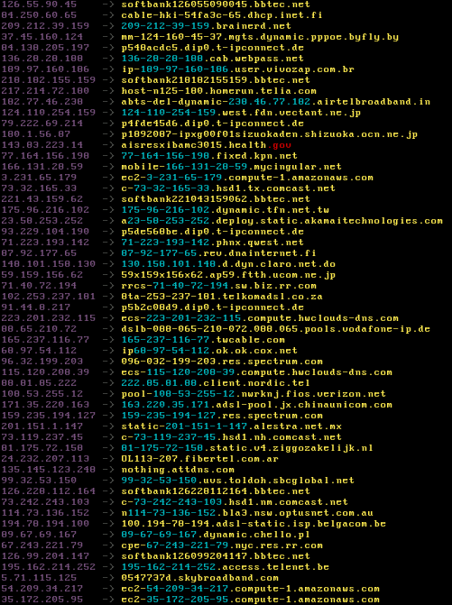

# PTR Stream

PTRStream is an asynchronous reverse DNS lookup tool developed in Python. It generates random IP addresses and performs reverse DNS lookups using various DNS servers.



## Requirements
- [python](https://www.python.org/)
- [aiodns](https://pypi.org/project/aiodns/) *(pip install aiodns)*

## Usage

```bash
python ptrstream.py [options]
```

| Argument               | Description                                                  |
| ---------------------- | ------------------------------------------------------------ |
|  `-c`, `--concurrency` | Control the speed of lookups. *(Default = 50)*               |
| `-t`, `--timeout`      | Timeout for DNS lookups.                                     |
| `-r`, `--resolvers`    | File containing DNS servers to use for lookups. *(Optional)* |

## Now what?
The results are cached and saved to a file named ptr_{date}_{seed}.txt after every 1000 successful lookups. After a full loop through every IP address, a new seed will generate and start the scan again.

Output to elastic search possibly.

Still a work in progress I guess...
