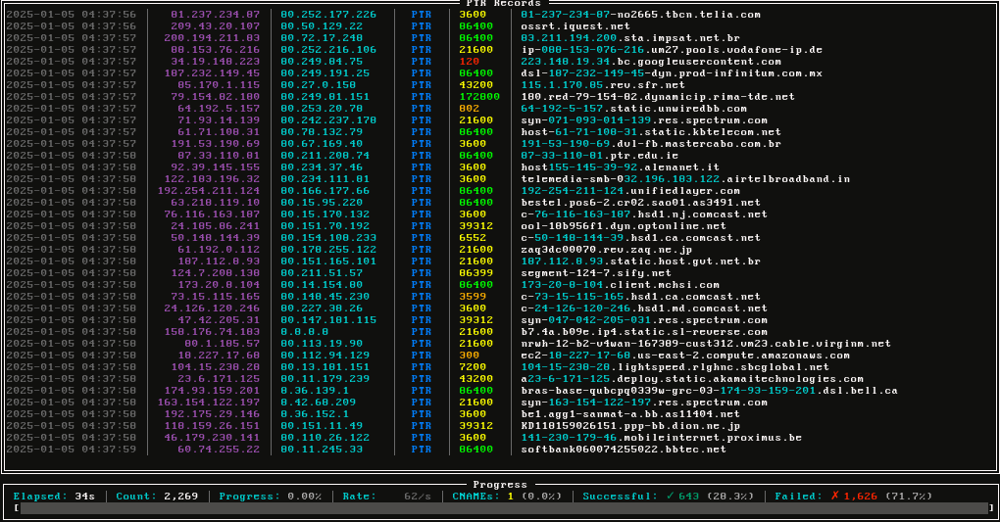

# PTR Stream

The ptrstream repository contains a straightforward yet well-crafted Python script for conducting reverse DNS lookups across the entire IPv4 address range. It systematically generates each IPv4 address in a pseudo-random sequence using a seed, ensuring every possible address is covered. For each IP address, the script performs a PTR *(reverse DNS)* lookup and logs all successful findings. Designed to run continuously, ptrstream is an efficient tool for network monitoring and tracking PTR records globally, making it a practical resource for network enthusiasts and professionals who require a reliable and uncomplicated solution for DNS monitoring.

## Requirements
- [python](https://www.python.org/)
- [aiodns](https://pypi.org/project/aiodns/) *(pip install aiodns)*

## Usage

```bash
python ptrstream.py [options]
```

| Argument              | Description                                                  |
| --------------------- | ------------------------------------------------------------ |
| `-c`, `--concurrency` | Control the speed of lookups. *(Default = 100)*              |
| `-t`, `--timeout`     | Timeout for DNS lookups. *(Default = 5s)*                    |
| `-r`, `--resolvers`   | File containing DNS servers to use for lookups. *(Optional)* |
| `-rt`, `--retries`    | Number of times to retry a DNS lookup *(Default = 3)*        |
| `-s`, `--seed`        | Seed to use for the random number generator.                 |

## Preview


___

###### Mirrors
[acid.vegas](https://git.acid.vegas/ptrstream) • [GitHub](https://github.com/acidvegas/ptrstream) • [GitLab](https://gitlab.com/acidvegas/ptrstream) • [SuperNETs](https://git.supernets.org/acidvegas/ptrstream)
